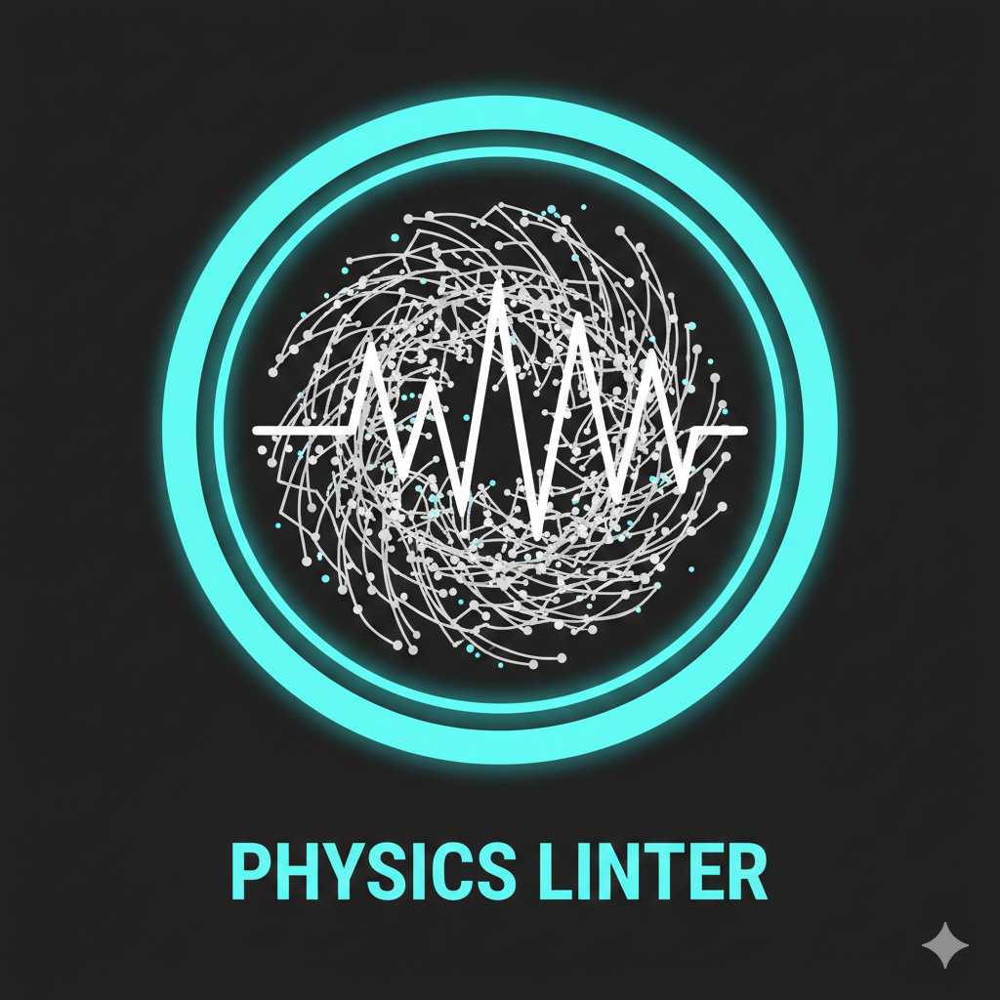

<!-- mcp-name: io.github.JonesRobM/physbound -->
<!-- keywords: MCP server, physics validation, RF link budget, Shannon-Hartley, thermal noise, antenna gain, AI hallucination detection, physical layer linter, Friis equation, FSPL, signal processing, telecommunications, radar range equation, radar cross section, RCS -->

<p align="center">
  
</p>

<h1 align="center">PhysBound</h1>

**Physical Layer Linter** — An [MCP server](https://modelcontextprotocol.io) that validates RF and physics calculations against hard physical limits. Catches AI hallucinations in engineering workflows.

[](https://github.com/JonesRobM/physbound/actions/workflows/ci.yml)
[](https://codecov.io/gh/JonesRobM/physbound)
[](https://pypi.org/project/physbound/)
[](https://registry.modelcontextprotocol.io)
[](LICENSE)
[](https://www.python.org/downloads/)
[](https://lobehub.com/mcp/jonesrobm-physbound)
[](https://ko-fi.com/jonesrobm)

---

## What LLMs Get Wrong

LLMs routinely hallucinate physics. PhysBound catches it:

| # | Category | LLM Hallucination | PhysBound Truth | Verdict |
|---|----------|-------------------|-----------------|---------|
| 1 | Shannon-Hartley | "20 MHz 802.11n at 15 dB SNR achieves 500 Mbps" | Shannon limit: **100.6 Mbps** | CAUGHT |
| 2 | Shannon-Hartley | "100 MHz 5G channel at 20 dB SNR delivers 2 Gbps" | Shannon limit: **665.8 Mbps** | CAUGHT |
| 3 | Antenna Aperture | "30 cm dish at 1 GHz provides 45 dBi gain" | Aperture limit: **7.4 dBi** | CAUGHT |
| 4 | Thermal Noise | "Noise floor of -180 dBm/Hz at room temperature" | Actual: **-174.0 dBm/Hz** at 290K | CAUGHT |
| 5 | Link Budget | "Wi-Fi at 2.4 GHz reaches 10 km at -40 dBm" | Actual RX power: **-94.1 dBm** | CAUGHT |
| 6 | Link Budget | "1W to GEO with 0 dBi antennas at -80 dBm" | Actual RX power: **-175.1 dBm** | CAUGHT |
| 7 | Link Budget | "Bluetooth reaches 1 km at -60 dBm" | Actual RX power: **-100.1 dBm** | CAUGHT |
| 8 | Shannon-Hartley | "10 MHz LTE at 10 dB SNR supports 1 Gbps" | Shannon limit: **34.6 Mbps** | CAUGHT |
| 9 | Noise Cascade | "Stage order doesn't affect system NF" | LNA first: **1.66 dB** vs mixer first: **8.03 dB** | CAUGHT |
| 10 | Antenna Aperture | "10 cm patch at 900 MHz provides 20 dBi" | Aperture limit: **-3.1 dBi** | CAUGHT |
| 11 | Radar Range | "Doubling TX power doubles radar range" | Range increases by **1.189x** (2^(1/4)), not 2x | CAUGHT |
| 12 | Radar Range | "Drone (0.01 m^2 RCS) at 200 km by 1 kW X-band" | Max range: **2.7 km** | CAUGHT |

*Generated automatically by `pytest tests/test_marketing.py -s`*

---

## Quick Start

### Install

```bash
pip install physbound
```

### MCP Client Configuration

Add PhysBound to any MCP-compatible client. For example, in Claude Desktop (`claude_desktop_config.json`), Cursor, or Windsurf:

```json
{
  "mcpServers": {
    "physbound": {
      "command": "uvx",
      "args": ["physbound"]
    }
  }
}
```

> **First run:** `uvx` downloads ~60 MB of dependencies (scipy, numpy) on first launch. Run `uvx physbound` once in your terminal to pre-cache them — subsequent starts will be instant.

Your AI assistant now has access to physics-validated RF calculations.

---

## Tools

### `rf_link_budget`

Computes a full RF link budget using the Friis transmission equation. Validates antenna gains against aperture limits.

**Example:** *"What's the received power for a 2.4 GHz link at 100 m with 20 dBm TX, 10 dBi TX gain, 3 dBi RX gain?"*

Returns: FSPL, received power, wavelength, and optional aperture limit checks. Rejects antenna gains that violate `G_max = eta * (pi * D / lambda)^2`.

### `shannon_hartley`

Computes Shannon-Hartley channel capacity `C = B * log2(1 + SNR)` and validates throughput claims.

**Example:** *"Can a 20 MHz channel with 15 dB SNR support 500 Mbps?"*

Returns: Theoretical capacity, spectral efficiency, and whether the claim is physically possible. Flags violations with the exact percentage by which the claim exceeds the Shannon limit.

### `noise_floor`

Computes thermal noise power `N = k_B * T * B`, cascades noise figures through multi-stage receivers using the Friis noise formula, and calculates receiver sensitivity.

**Example:** *"What's the noise floor for a 1 MHz receiver at 290K with a two-stage LNA chain?"*

Returns: Thermal noise in dBm and watts, cascaded noise figure, system noise temperature, and receiver sensitivity.

### `radar_range`

Computes the monostatic radar range equation `R_max = [P_t G^2 lambda^2 sigma / ((4pi)^3 S_min L)]^(1/4)` and validates detection range claims.

**Example:** *"Can a 1 kW X-band radar with 30 dBi gain detect a 0.01 m^2 drone at 200 km?"*

Returns: Maximum detection range, minimum detectable signal, wavelength, and intermediate values. Catches the common fourth-root fallacy where doubling power is incorrectly assumed to double range.

---

## Physics Guarantees

Every calculation is validated against hard physical limits:

- **Speed of light:** `c = 299,792,458 m/s` — no exceptions
- **Thermal noise floor:** `N = -174 dBm/Hz` at 290K — the IEEE standard reference
- **Shannon limit:** `C = B * log2(1 + SNR)` — no throughput claim exceeds this
- **Aperture limit:** `G_max = eta * (pi * D / lambda)^2` — antenna gain is bounded by physics
- **Radar range equation:** `R_max = [P_t G^2 lambda^2 sigma / ((4pi)^3 S_min)]^(1/4)` — range obeys the fourth-root law

Violations return structured `PhysicalViolationError` responses with LaTeX explanations, not silent failures.

---

## Examples

See PhysBound catching hallucinations in real time:

- **[Catching Hallucinations](examples/catching-hallucinations.md)** — walkthrough of four real LLM failure modes with full JSON responses
- **[Interactive Demo Notebook](examples/physbound-demo.ipynb)** — hands-on Jupyter notebook calling the physics engines directly

---

## Development

```bash
# Clone and install
git clone https://github.com/JonesRobM/physbound.git
cd physbound
uv sync --all-extras

# Run tests
uv run pytest tests/ -v

# Print hallucination delta table
uv run pytest tests/test_marketing.py -s

# Start MCP server locally
uv run physbound
```

## Why PhysBound?

AI coding assistants are increasingly used in RF engineering, telecommunications, and signal processing workflows. But LLMs have no intrinsic understanding of physics. They generate plausible-sounding numbers that can violate fundamental laws like Shannon-Hartley, thermodynamic noise limits, and antenna aperture bounds.

PhysBound acts as a **physics guardrail** for any MCP-compatible AI assistant. Every calculation is checked against CODATA physical constants via SciPy, with dimensional analysis enforced through Pint. Violations return structured errors with LaTeX explanations, not silent failures.

### Use cases

- **RF system design review** — validate link budgets, receiver sensitivity, and noise cascades
- **Telecom proposal vetting** — catch impossible throughput claims before they reach a customer
- **Educational tools** — teach Shannon-Hartley, Friis transmission, and thermal noise with verified calculations
- **CI/CD for physics** — integrate as a validation step in engineering pipelines

## Support

If PhysBound is useful in your work, consider [buying me a coffee](https://ko-fi.com/jonesrobm).

## License

MIT License. See [LICENSE](LICENSE).

## Related

- [Model Context Protocol](https://modelcontextprotocol.io) — the open standard for AI tool integration
- [MCP Server Registry](https://registry.modelcontextprotocol.io) — official directory of MCP servers
- [FastMCP](https://github.com/jlowin/fastmcp) — Python framework for building MCP servers
