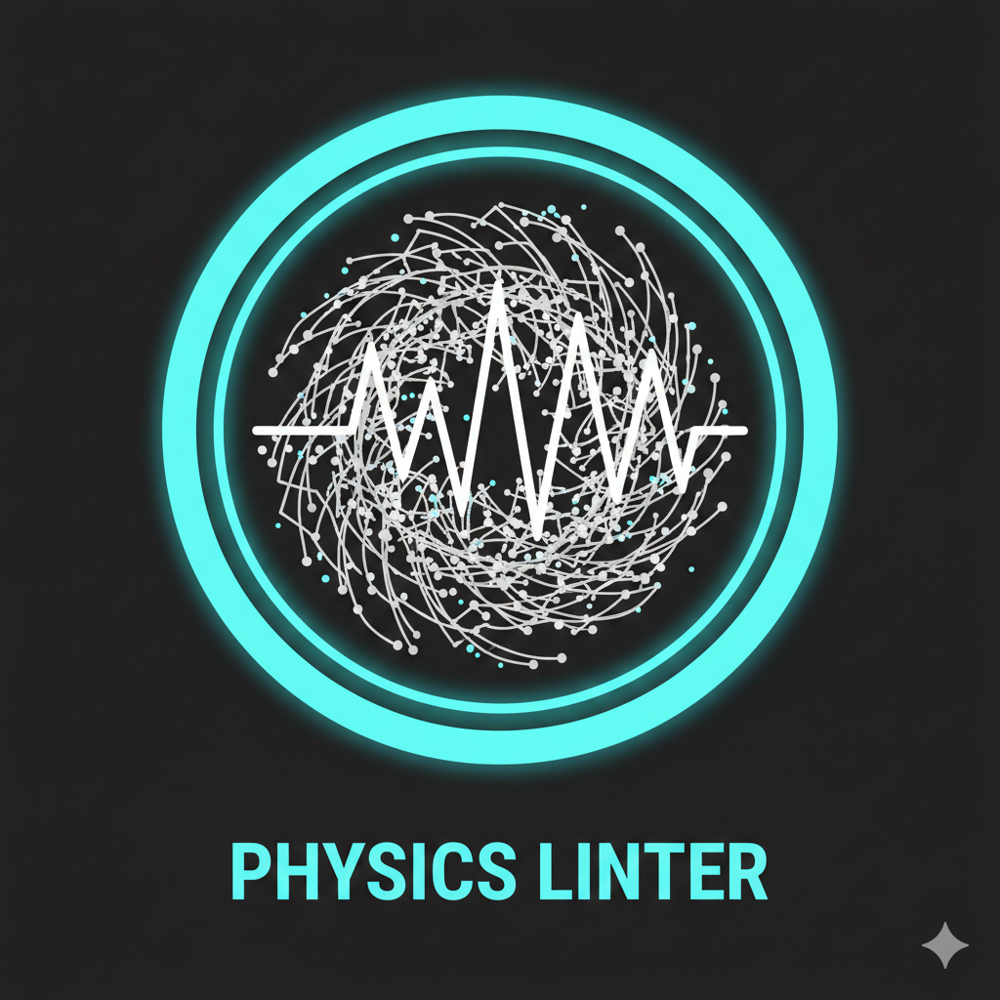

<!-- mcp-name: io.github.JonesRobM/physbound -->
<!-- keywords: MCP server, physics validation, RF link budget, Shannon-Hartley, thermal noise, antenna gain, aperture limit, Harrington bound, AI hallucination detection, physical layer linter, Friis equation, FSPL, signal processing, telecommunications, radar range equation, radar cross section, RCS, radar ambiguity, pulse-Doppler, Doppler shift, unambiguous range, blind speed, range-Doppler dilemma -->

<p align="center">
  
</p>

<h1 align="center">PhysBound</h1>

<p align="center"><strong>Physical Layer Linter</strong> — an <a href="https://modelcontextprotocol.io">MCP server</a> that validates RF and physics calculations against hard physical limits, catching AI hallucinations in engineering workflows.</p>

<p align="center">
  <a href="https://github.com/JonesRobM/physbound/actions/workflows/ci.yml"></a>
  <a href="https://codecov.io/gh/JonesRobM/physbound"></a>
  <a href="https://pypi.org/project/physbound/"></a>
  <a href="https://registry.modelcontextprotocol.io"></a>
  <a href="LICENSE"></a>
  <a href="https://www.python.org/downloads/"></a>
  <a href="https://lobehub.com/mcp/jonesrobm-physbound"></a>
  <a href="https://ko-fi.com/jonesrobm"></a>
</p>

---

LLMs generate plausible-sounding RF numbers that violate fundamental physics — throughput above the Shannon limit, antenna gains no aperture can produce, radar ranges the range equation forbids. PhysBound gives any MCP-compatible AI assistant six validated calculation tools, backed by CODATA constants (via SciPy) and dimensional analysis (via Pint). Impossible claims return structured `PhysicalViolationError` responses with the violated law, the computed limit, and a LaTeX explanation — not silent failures.

| Tool | What it validates |
|------|-------------------|
| [`rf_link_budget`](#rf_link_budget) | Friis link budgets: FSPL, received power, antenna gains vs. aperture/Harrington limits |
| [`shannon_hartley`](#shannon_hartley) | Throughput claims against channel capacity `C = B log2(1 + SNR)` |
| [`noise_floor`](#noise_floor) | Thermal noise `kTB`, Friis noise-figure cascades, receiver sensitivity |
| [`radar_range`](#radar_range) | Detection-range claims against the monostatic radar range equation |
| [`antenna_gain`](#antenna_gain) | Gain limits, beamwidth, and far-field distance for a single antenna |
| [`radar_ambiguity`](#radar_ambiguity) | Pulse-Doppler unambiguous range/velocity, Doppler aliasing, range resolution |

## Installation

PhysBound is a standard stdio MCP server published on [PyPI](https://pypi.org/project/physbound/). The recommended launch command is [`uvx physbound`](https://docs.astral.sh/uv/), which fetches and runs the latest release in an isolated environment — no manual install step.

> **First run:** `uvx` downloads ~60 MB of dependencies (SciPy, NumPy) the first time. Run `uvx physbound` once in a terminal to pre-cache them (Ctrl-C to exit); subsequent starts are instant.

### Claude Code

```bash
claude mcp add physbound -- uvx physbound
```

### Claude Desktop

Add to `claude_desktop_config.json` (macOS: `~/Library/Application Support/Claude/`, Windows: `%APPDATA%\Claude\`):

```json
{
  "mcpServers": {
    "physbound": {
      "command": "uvx",
      "args": ["physbound"]
    }
  }
}
```

### Cursor, Windsurf, and other MCP clients

Use the same JSON server entry as above in your client's MCP configuration file (Cursor: `~/.cursor/mcp.json`; Windsurf: `~/.codeium/windsurf/mcp_config.json`).

### Without uv

If you prefer a plain Python install (requires Python 3.12+):

```bash
pip install physbound
```

then set `"command": "physbound"` (with no `args`) in the client configuration.

Once configured, ask your assistant an RF question — *"Can a 20 MHz channel with 15 dB SNR support 500 Mbps?"* — and it will answer with physics-validated numbers.

## What LLMs Get Wrong

Sixteen real hallucination patterns, each caught by PhysBound's test suite:

| # | Category | LLM Hallucination | PhysBound Truth | Verdict |
|---|----------|-------------------|-----------------|---------|
| 1 | Shannon-Hartley | A 20 MHz 802.11n channel with 15 dB SNR can achieve 500 Mbps | Shannon limit: 100.6 Mbps (not 500 Mbps) | CAUGHT |
| 2 | Shannon-Hartley | A 100 MHz 5G channel with 20 dB SNR delivers 2 Gbps | Shannon limit: 665.8 Mbps (not 2000 Mbps) | CAUGHT |
| 3 | Antenna Aperture | A 30 cm dish antenna at 1 GHz provides 45 dBi gain | Physical limit: 12.1 dBi (Harrington); aperture eta=1: 9.9 dBi; typical dish: 7.4 dBi (eta=0.55) (not 45 dBi) | CAUGHT |
| 4 | Thermal Noise | Receiver noise floor of -180 dBm/Hz at room temperature | Thermal noise floor: -174.0 dBm/Hz at 290K (not -180 dBm/Hz) | CAUGHT |
| 5 | Link Budget / FSPL | Wi-Fi at 2.4 GHz with 20 dBm TX reaches 10 km with -40 dBm RX power | Actual RX power at 10 km: -94.1 dBm (not -40 dBm) | CAUGHT |
| 6 | Link Budget / FSPL | A 1W transmitter at 12 GHz with 0 dBi antennas reaches GEO at -80 dBm | Actual RX power at GEO: -175.1 dBm (not -80 dBm) | CAUGHT |
| 7 | Link Budget / FSPL | Bluetooth at 2.4 GHz with 0 dBm TX and 0 dBi antennas reaches 1 km at -60 dBm | Actual RX power at 1 km: -100.1 dBm (not -60 dBm) | CAUGHT |
| 8 | Shannon-Hartley | A 10 MHz LTE channel at 10 dB SNR supports 1 Gbps | Shannon limit: 34.6 Mbps (not 1000 Mbps) | CAUGHT |
| 9 | Noise Cascade | Receiver NF is the same regardless of stage order: LNA(20dB/1.5dB) + Mixer(10dB/8dB) | LNA first: 1.66 dB vs mixer first: 8.03 dB (penalty: 6.4 dB) | CAUGHT |
| 10 | Antenna Aperture | A 10 cm patch antenna at 900 MHz provides 20 dBi gain | Physical limit: 4.4 dBi (Harrington, D < lambda); aperture eta=1: -0.5 dBi; typical: -3.1 dBi (eta=0.55) (not 20 dBi) | CAUGHT |
| 11 | Radar Range Equation | Doubling transmit power doubles radar detection range | Range increases by factor 1.189 (2^(1/4) = 1.189), not 2.0 | CAUGHT |
| 12 | Radar Range Equation | Small drone (0.01 m^2 RCS) detectable at 200 km by 1 kW X-band radar with 30 dBi gain | Max range: 2.7 km for 0.01 m^2 RCS at 1 kW X-band (not 200 km) | CAUGHT |
| 13 | Antenna Gain | A 0.5 m user-terminal dish at 12 GHz gives 50 dBi gain | Physical limit: 36.1 dBi (Harrington); typical dish: 33.4 dBi (eta=0.55) (not 50 dBi) | CAUGHT |
| 14 | Antenna Gain | A 3 m dish at 10 GHz is in its far field at 10 m, so gain can be measured there | Far-field distance 2D^2/lambda = 600 m; 10 m is in the near field | CAUGHT |
| 15 | Radar Ambiguity | A 10 GHz radar at 10 kHz PRF unambiguously measures 500 m/s | v_ua = lambda*PRF/4 = +/-74.9 m/s (blind speed 149.9 m/s); 500 m/s aliases (not 500 m/s) | CAUGHT |
| 16 | Radar Ambiguity | A 10 GHz pulse-Doppler radar can unambiguously cover 150 km and +/-300 m/s at once | R_ua*v_ua = c*lambda/8 = 1.123e+06 m^2/s for any PRF; claimed 4.5e+07 m^2/s (40x too large) | CAUGHT |

*Generated automatically by `pytest tests/test_marketing.py -s`*

## Tools

Full derivations, sources, and worked examples for every formula are in [`docs/formulas.md`](docs/formulas.md).

### `rf_link_budget`

Computes a complete RF link budget using the Friis transmission equation and validates antenna gains against physical limits.

**Example:** *"What's the received power for a 2.4 GHz link at 100 m with 20 dBm TX, 10 dBi TX gain, 3 dBi RX gain?"*

Returns FSPL, received power, wavelength, and — when antenna diameters are supplied — gain limit checks. Gains above the hard bound `G_max = max((pi D / lambda)^2, (ka)^2 + 2ka)` (the eta = 1 aperture value, or Harrington's bound for electrically small antennas) are rejected; gains above the typical dish value (eta = 0.55) are accepted with a warning. Also warns inside the far-field distance `2D^2/lambda` and rejects negative losses.

### `shannon_hartley`

Computes Shannon-Hartley channel capacity `C = B log2(1 + SNR)` and validates throughput claims.

**Example:** *"Can a 20 MHz channel with 15 dB SNR support 500 Mbps?"*

Returns theoretical capacity, spectral efficiency, and whether the claim is physically possible, including the exact percentage by which a violating claim exceeds the Shannon limit.

### `noise_floor`

Computes thermal noise power `N = k_B T B`, cascades noise figures through multi-stage receivers with the Friis noise formula, and calculates receiver sensitivity.

**Example:** *"What's the noise floor for a 1 MHz receiver at 290 K with a two-stage LNA chain?"*

Returns thermal noise in dBm and watts, cascaded noise figure, effective input noise temperature `T_e = 290 K * (F - 1)`, and receiver sensitivity.

### `radar_range`

Computes the monostatic radar range equation `R_max = [P_t G^2 lambda^2 sigma / ((4pi)^3 S_min L)]^(1/4)` and validates detection-range claims.

**Example:** *"Can a 1 kW X-band radar with 30 dBi gain detect a 0.01 m^2 drone at 200 km?"*

Returns maximum detection range, minimum detectable signal, wavelength, and intermediate values. Catches the common fourth-root fallacy that doubling power doubles range.

### `antenna_gain`

Analyses a single antenna from its diameter or physical area: gain limits, beamwidth, and far-field distance, with optional validation of a claimed gain.

**Example:** *"Can a 0.5 m dish at 12 GHz really give 50 dBi? What beamwidth should I expect?"*

Returns the physical gain limit (aperture or Harrington bound, and which one governs), typical gain at the given efficiency (default 0.55), effective aperture, half-power beamwidth estimates, far-field distance `2D^2/lambda`, and — for a claimed gain — the implied aperture efficiency and validity.

### `radar_ambiguity`

Computes pulse-Doppler ambiguity limits for a given carrier frequency and PRF.

**Example:** *"Can a 10 GHz radar at 10 kHz PRF unambiguously measure a 500 m/s target out to 150 km?"*

Returns unambiguous range `R_ua = c / (2 PRF)`, unambiguous velocity `v_ua = lambda PRF / 4`, blind speed, Doppler shift and apparent (aliased) velocity, range resolution (`c tau / 2`, or `c / 2B` with pulse compression), minimum range, duty cycle, and the range-Doppler dilemma invariant `R_ua v_ua = c lambda / 8`. Rejects range, velocity, or resolution claims the PRF or pulse cannot support.

## Physics Guarantees

Every calculation is validated against hard physical limits:

- **Speed of light:** `c = 299,792,458 m/s` — no exceptions
- **Thermal noise floor:** `N = -174 dBm/Hz` at 290 K — the IEEE standard reference
- **Shannon limit:** `C = B log2(1 + SNR)` — no throughput claim exceeds this
- **Antenna gain limit:** `G_max = max((pi D / lambda)^2, (ka)^2 + 2ka)` — the eta = 1 aperture value for planar apertures and Harrington's bound for any antenna in a sphere of diameter D; eta = 0.55 is a warning threshold, not a limit
- **Radar range equation:** `R_max = [P_t G^2 lambda^2 sigma / ((4pi)^3 S_min)]^(1/4)` — range obeys the fourth-root law
- **Receiver sensitivity:** `S_min = k (T_A + T_0 (F - 1)) B * SNR` with `T_e = T_0 (F - 1)` referenced to 290 K
- **Unambiguous range:** `R_ua = c / (2 PRF)` — echoes beyond it fold into a later pulse interval
- **Unambiguous velocity:** `v_ua = lambda PRF / 4` — Doppler is sampled at the PRF, so `|f_d| <= PRF/2`
- **Range-Doppler dilemma:** `R_ua * v_ua = c lambda / 8` — no PRF choice beats it for a given carrier

Violations return structured `PhysicalViolationError` responses with LaTeX explanations, not silent failures.

## Examples and Documentation

- **[Catching Hallucinations](examples/catching-hallucinations.md)** — walkthrough of five real LLM failure modes with full JSON responses
- **[Interactive Demo Notebook](examples/physbound-demo.ipynb)** — Jupyter notebook calling the physics engines directly
- **[Formula Reference](docs/formulas.md)** — every formula, constant, and validation guard with sources
- **[Changelog](CHANGELOG.md)** — release history

## Development

Requires [uv](https://docs.astral.sh/uv/) and Python 3.12+ (CI covers 3.12–3.14):

```bash
# Clone and install
git clone https://github.com/JonesRobM/physbound.git
cd physbound
uv sync --all-extras

# Run checks
uv run pytest tests/ -v
uv run ruff check src/ tests/
uv run mypy src/physbound/

# Regenerate the hallucination table above
uv run pytest tests/test_marketing.py -s

# Start the MCP server locally
uv run physbound
```

Contributions that expand the set of validated physics domains are welcome — see [CONTRIBUTING.md](CONTRIBUTING.md) for the architecture guide and the step-by-step recipe for adding a new validator.

## Use Cases

- **RF system design review** — validate link budgets, receiver sensitivity, and noise cascades
- **Telecom proposal vetting** — catch impossible throughput claims before they reach a customer
- **Radar system sizing** — sanity-check detection range, PRF selection, and ambiguity trade-offs
- **Educational tools** — teach Shannon-Hartley, Friis transmission, and thermal noise with verified calculations
- **CI/CD for physics** — integrate as a validation step in engineering pipelines

## Support

If PhysBound is useful in your work, consider [buying me a coffee](https://ko-fi.com/jonesrobm).

## License

MIT License. See [LICENSE](LICENSE).

## Related

- [Model Context Protocol](https://modelcontextprotocol.io) — the open standard for AI tool integration
- [MCP Server Registry](https://registry.modelcontextprotocol.io) — official directory of MCP servers
- [FastMCP](https://github.com/jlowin/fastmcp) — Python framework for building MCP servers
